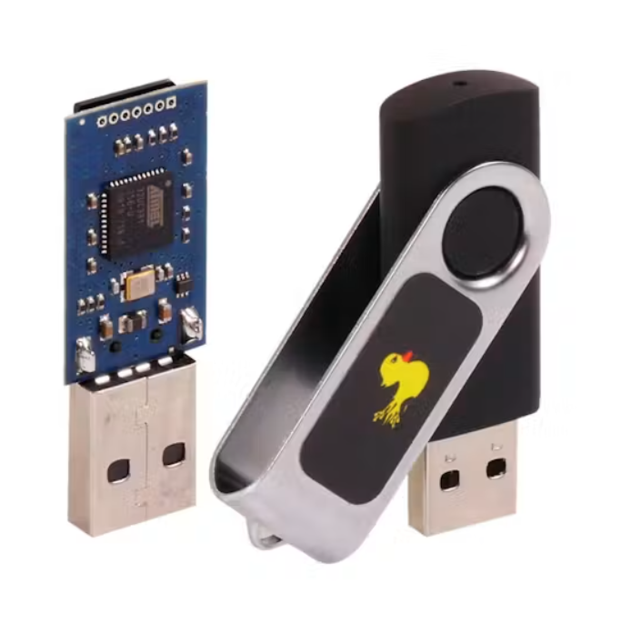
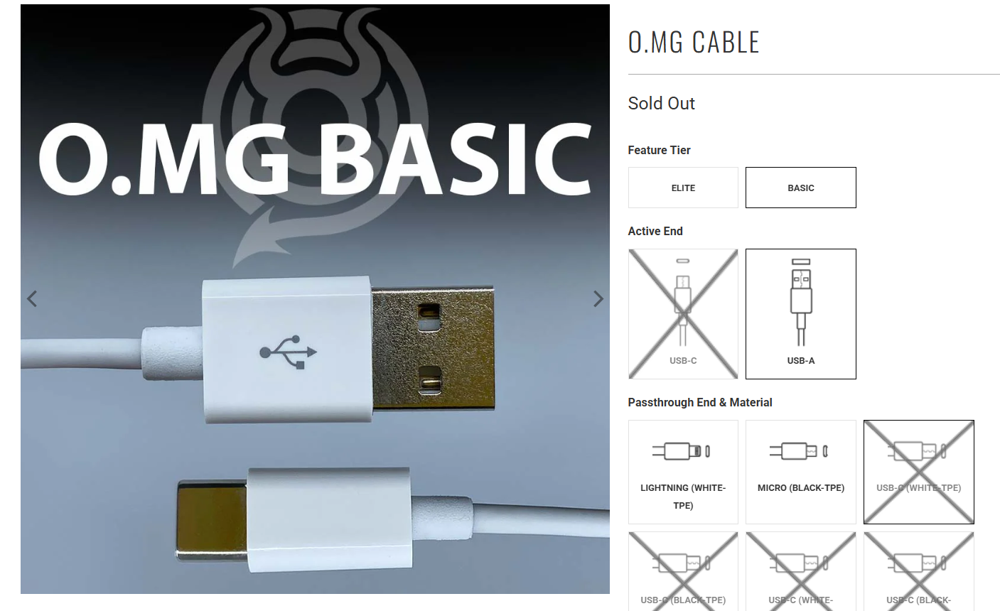

# x)  Darknet Diaries EP161: MG  

Tässä episodissa Jack Rhysider haastattelee miestä tunnettu nimellä MG.  
MG on nokkela häkkeri ja laitteistoinsinööri, joka on OMG kaapelin luoja.  
Hän sai idean yhdistää USB Rubber Ducky ja tavallisen USB kaapelin toisiinsa.  

USB Rubber Ducky on muistitikun näköinen, jonka avulla voidaan injektoida haittaohjelmia.  
Se sijoitetaan tietokoneen USB porttiin, ja esiintyy laitteen sisällä näppäimistönä.  
Tämän jälkeen USB:n sisällä oleva skripti suoritetaan parissa sekunissa.  

  
  

  
  

OMG kaapeli on todella normaalin näköinen USB kaapeli, mutta tekee jotain muuta.  
Tämä kaapeli on varustettu Wifillä, micro kontrollerilla,  

a)  

b)  

c)  

d)  

e)  

Lähteet: 
