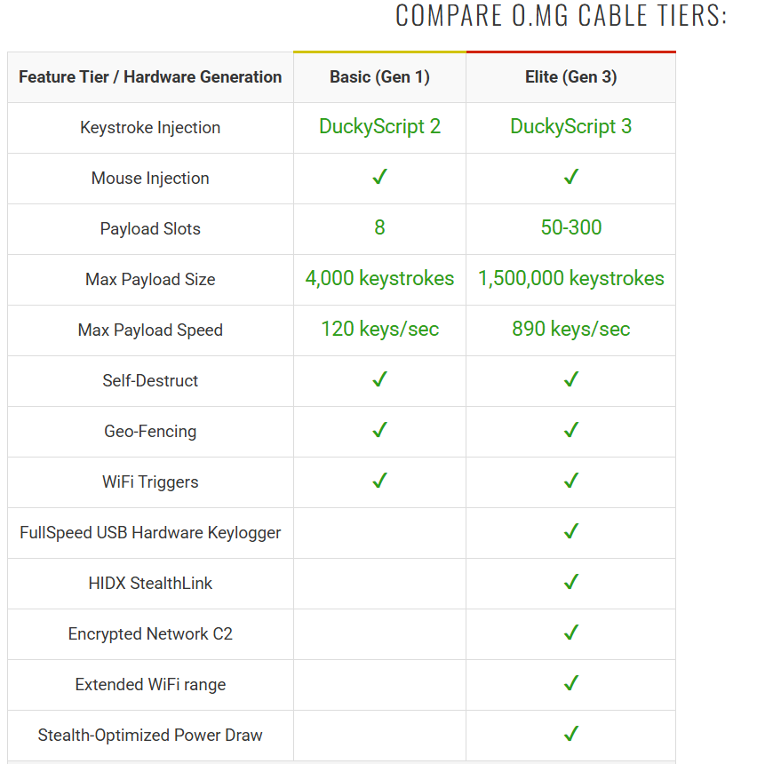
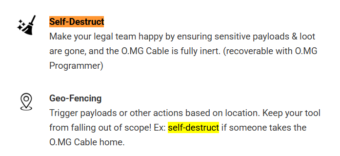
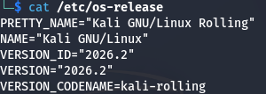
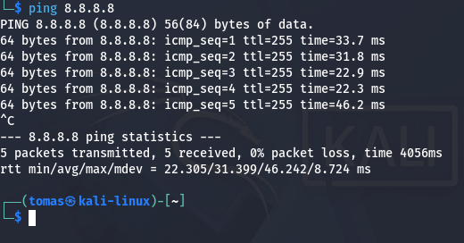
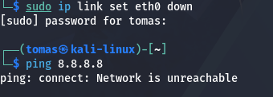
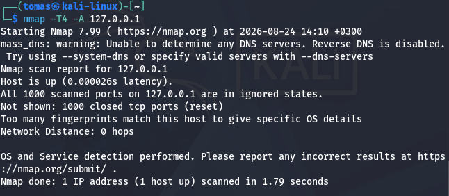
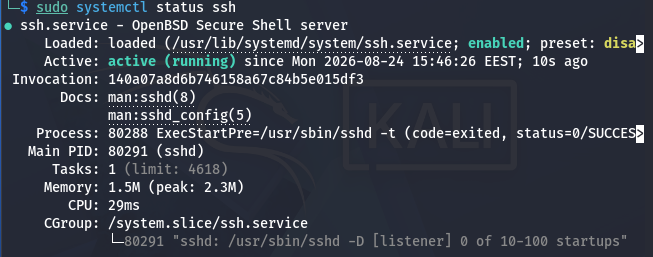
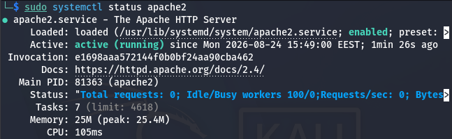

# x)  Darknet Diaries EP161: MG  

Tässä episodissa Jack Rhysider haastattelee miestä tunnettu nimellä MG.  
MG on nokkela häkkeri ja laitteistoinsinööri, joka on O.MG kaapelin luoja.  
Hän sai idean yhdistää USB Rubber Ducky ja tavallisen USB kaapelin toisiinsa.  

USB Rubber Ducky on muistitikun näköinen, jonka avulla voidaan suorittaa haittaohjelmia.  
Se sijoitetaan tietokoneen USB porttiin, ja esiintyy laitteen sisällä näppäimistönä.  
Tämän jälkeen USB:n sisällä oleva skripti suoritetaan parissa sekunissa.  

  
[Rubber Ducky USB](https://www.hackster.io/ikigai/rubber-ducky-using-arduino-593fb1)  

 

OMG kaapeli on todella normaalin näköinen USB kaapeli, mutta tekee jotain muuta.  
Varustettu wifillä, microkontrollerilla ja muilla kivoilla ominaisuuksilla.  
Näiden avulla on mahdollista syöttää haittaohjelmia ja ottaa etäyhteys uhrin laitteeseen.  
Sama kaapeli toimii myös esim. laturina, joten uhri ei välttämättä heti huomaa ladatessaan älypuhelinta.  
OMG kaapelista on kaksi mallia eri lisäominaisuuksilla ja monia eri USB-kaapelin pää liitäntöjä.  
Pääsääntöisesti USB-A ja C liitännät.  

 

  
[OMG-Kaapeli](https://shop.hak5.org/products/omg-cable?variant=39808315228273/)  
 

 

  
[OMG-Kaapeli](https://shop.hak5.org/products/omg-cable?variant=39808316113009)  

 

  
[OMG-Kaapeli](https://shop.hak5.org/products/omg-cable?variant=39808316113009)  

# Intrusion Kill Chain  
Intrusion Kill Chain tai tunkeutumisen tappoketju on systemaattinen prosessi,  
jonka tarkoituksena on hyökätä vastustajaan samalla saavuttaen haluttu ratkaisu.  
Tähän toimet tämän saavuttamiseksi tehdään ketjumaisessa prosessissa.  

Tietoverkkohyökkäysissä tai vakoiluissa prosessi on kyseinen:  
1. Tiedustelu. Kohde havaitaan, tutkitaan ja valitaan käyttäen avoimia lähteitä tai sosiaalisia suhteita.  
2. Aseistaminen. Etäkäyttö troijanin (RAT) ja hyödyntämiskoodin yhdistys toimitettavaksi hyötykuormaksi. Usein aseistustyökalun avulla.  
3. Toimitus. Asetta käytetään vastustajaa vastaan.  
4. Hyväksikäyttö. Aseen käytön jälkeen aloitetaan haavoittovuuden hyödyntäminen.  
5. Asennus. Etäkäyttö troijanin (RAT) ja takaovi asennetaan, jotta saadaan ylläpitää pysyvyyttä ympäristössä.  
6. Johda ja hallitse. Isäntäkoneen on lähetettävä signaaleja ulospäin ohjauspalvelimelle C2-yhteyden muodostamiseksi.  
7. Tavoitteisiin liittyvät toimenpiteet. Todellinen operaation alku alkaa tästä. Eli esim. tiedon kerääminen ja siirtäminen.  

# Santos et al: The Art of Hacking (Video Collection)  
Videokokoelmassa käydään läpi, miten verkkojen aktiivinen tiedustelu toimii.  
Aktiivinen tiedustelu eroaa passiivisesta tiedustelusta siten, että tietoa lähetetään kohdeverkkoon.  
Tätä voidaan tehdä porttiskannauksella, jossa tarkistetaan avoimet portit.  

 
# KKO 2003:36  
123

 

 

## a) Asenna Kali virtuaalikoneeseen  
Asensin Kalin graafisesti VirtualBoxin avulla.  
  

## b) Irrota Kali-virtuaalikone verkosta  

Testaus nykyisestä internet yhteydestä:  
  

 

Yhteyden katkaisu:  
  

## c) Porttiskannaa 1000 tavallisinta tcp-porttia omasta koneestasi  

Käytin skannauksessa komentoa "nmap -T4 -A 127.0.0.1"  
Parametrien merkitykset:  
Nmap = Ohjelma, jolla porttiskannaus toteutetaan  
-T4 = Nopeus taso skannaukselle, eli kuinka nopeasti portin skannaus suoritetaan.   
-A = Aggressiivinen skannaus muoto jonka avulla tehdään yksityiskohtaisempi skannaus.  
localhost/127.0.0.1 = Kohde  

Kuvasta sain ymmärrettyä Nmapin toimivan.  
Nimipalvelin ei toimi.  
Nmap skannasi osoitteen 127.0.0.1  
Kohde on tavoitettavissa.  
Kaikki 1000 porttia sivuuttavat tulevat pyynnöt.  
Niitä Nmap ei esitä tuloksessa.  
Verkkoetäisyys 0 hyppyä eli skannaus nykyisessä laitteessa menemättä esim. reitittimen läpi.  

## d) Asenna kaksi vapaavalintaista demonia ja skannaa uudelleen.  

Otin yhteyden takaisin internettiin ja asensin apache2 ja SSH.  

SSH toimii.  
  

 

Apache2 toimii.  
  

Seuraavaksi katkaisin internet yhteyden ja tämän jälkeen aloitin skannauksen.  

e)  

Lähteet: 
https://darknetdiaries.com/episode/161/  

https://lockheedmartin.com/content/dam/lockheed-martin/rms/documents/cyber/LM-White-Paper-Intel-Driven-Defense.pdf  
