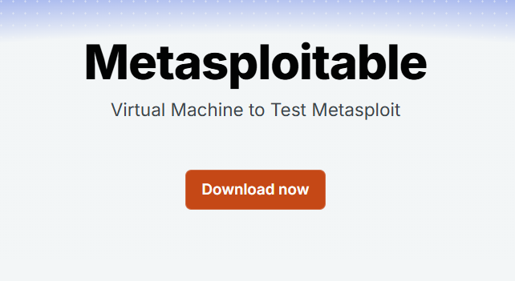
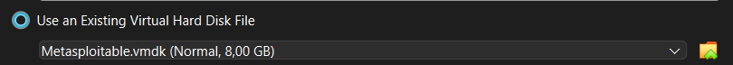
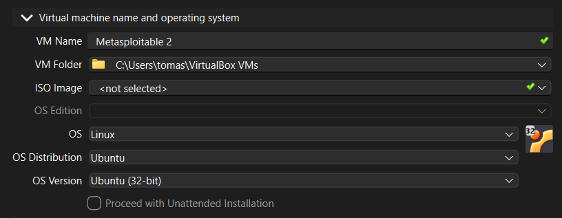
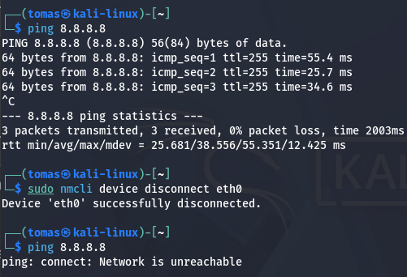
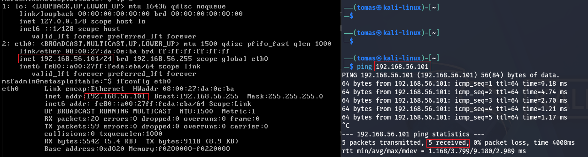
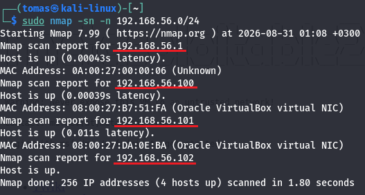
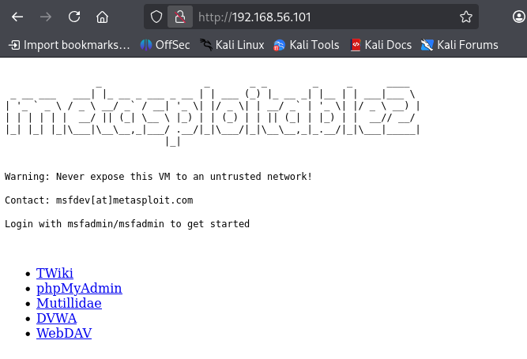
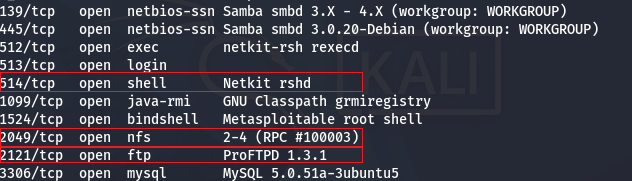

# H2 DORA  

## x) Buuri 2026: DORA and TLPT testing  

Digitaalista häiriönsietokykyä koskeva asetus (DORA), on EU alueen finanssisektoria koskeva säädös.  
Tämän tarkoituksena on hallita kyberriskejä tekemällä haavoittuvuuksien arviointeja, verkkoturvallisuuden tarkastuksia, suppean laajuuden tunkeutumistestejä jne.  
TLPT (Threat-Led Penetration Testing) on myös osana DORA asetusta. TLPT on kehittynein tunkeutumistestausmenetelmä tullessaan voimaan 2025.  
Vaativuustasoltaan organisoidun rikollisuuden ja kansallisvaltion toiminnan tasoista testausta.  
(Buuri 2026)  

## DORA Regulation Article 26, 27  
- **Article 26 Advanced testing of ICT tools, systems and processes based on TLPT**  
Artikkelissa 26 kerrotaan eri vaatimuksista DORA:a koskevia yrityksiä varten.  
Tiivistettynä se näyttää osittain tältä:  
  
Vähintään kolmen vuoden välein on DORA:a koskevia yritysten on suoritettava testejä TLPT-menetelmällä.  
Kaikki yrityksen kriittiset ICT-järjestelmät, teknologiat ja palvelut on tunnistettava osaksi testejä.  
Jos kolmannen osapuolen palveluntarjoajat tunnistetaan kuuluvaksi TLPT-testejä varten, on rahoituslaitoksen varmistettava heidän osallistumisen testaukseen.
TLPT-testauksien päätyttyä, on näistä luotava yhteenveto viranomaisille havainnoista ja korjaavista toimenpiteistä sekä asiakirjat todistaen testejen suoritumisen vaatimusten mukaisesti.  
(Asetus (EU) 2022/2554, 26 artikla)  

  
- **Requirements for testers for the carrying out of TLPT**  
Artikkelin 27 mukaan:

TLPT testaajissa voi olla mukana vain hyvämaineiset ja soveltuvat,  
joilla on erityisasiantuntemusta tunkeutumistestauksesta ja "red team" testauksesta.  
Noudattavat virallisia toimintaohjeita tai eettisiä periaatteita.  
Pystyvät antamaan riippumattoman vakuutuksen tai tarkastusraportin TLPT-testauksen suorittamiseen liittyvien riskien asianmukaisesta hallinnasta.  
Testaajien on oltava kattavasti vakuutettuja, jossa katetaan myös väärinkäytöksistä ja huolimattomuudesta aiheutuvat riskit.  
(Asetus (EU) 2022/2554, 27 artikla)  

## TIBER-FI 5.4.1 Red team test plan creation  
Red tiimeissä on tarkoitus laatia hyökkäys suunnitelma, jonka avulla hyökätään ja saadaan haluttu tulos kohteelle.  
Tähän suunnitelmaan kuuluu kaikki tavoitteet, kuten liput ja miten niihin edetään. Testeissä esiintyy aina riskejä puolustavien laitteille ja niiden tiedoille ja red tiimin on sisällytettävä suunnitelmassaan näiden riskien hallinta. Testisuunnitelmassa on myös oltava ajoitukset skenaarioille, eskalaation menettelytavoista.  

## a) asenna Metasploitable 2 virtuaalikoneeseen  
Latasin Metasploitablen Rapid7:n sivuilta ja käytin VirtualBoxia tämän käynnistämiseen.  
  

  

  

## b) Tee Kalin ja Metasploitablen välille virtuaaliverkko, jos säätelet VirtualBoxista  
Asetin Kalille ja Metasploitable koneelle saman host only adapterin, jonka avulla yhteys muodostetaan toisiinsa.  
Kalilla on vielä käytössä toinen adapteri, jolla yhteys internettiin on mahdollista.  

KALI: NAT + Host only adapter  
METASPLOITABLE: Host only adapter  

## c) Kali ja Metaspoitable. Osoita testein, että 1) koneet eivät saa yhteyttä Internetiin 2) Koneet saavat yhteyden toisiinsa  

Tässä Kalin testaukset internet yhteydestä ja tämän katkaisemisesta.  
  

Ping komento Kali koneelta Metasploit koneelle.  
  

> **Note** ChatGPT V5.6 käytettiin virtuaalikoneiden alustavien asetusten säädöissä ja terminaalien komennoissa.  

## d) Etsi Metasploitable porttiskannaamalla (nmap -sn)  
- Tarkista selaimella, että löysit oikean IP:n - Metasploitablen weppipalvelimen etusivulla lukee Metasploitable  

Suoritin Nmap -sn -n 192.168.56.0/24 saadakseni mahdolliset IP osoitteet.  
"-n" estää DNS kyselyn tapahtumasta. Huomasin hieman myöhemmin, että eihän tällä lisäasetuksella ollut tässä merkitystä.    
  

> **Note** ChatGPT V5.6 käytettiin komennoissa.    

## e) Porttiskannaa Metasploitable huolellisesti ja kaikki portit (nmap -A -T4 -p-). Poimi 2-3 hyökkääjälle kiinnostavinta porttia  

Skannauksen jälkeen huomasin hyökkääjälle mahdollisesti kiinnostavimmat portit:  
- 514/TCP open shell Netkit rshd
- 2049/TCP open nfs 2-4 (RPC #100003)
- 2121/TCP open ftp ProFTPD 1.3.1

Portin 514 kohdalla on shell ja tämän deamon on Netkitillä käytössä.  
Tämä mahdollistaa xxxx

2049 portissa on nfs. nfs on xxxxx

2121 kohdalla on ftp. ftp:n avulla on mahdollista siirtää tiedostoja xxxx

  

Lähteet:  
Metasploitable: https://www.rapid7.com/products/metasploit/metasploitable/  
Buuri 2026: https://terokarvinen.com/buuri-2026-dora-and-threat-lead-penetration-testing/buuri-2026-dora-and-threat-lead-penetration-testing--teros-pentest-course.pdf  
TIBER-FI: https://www.suomenpankki.fi/globalassets/bof/en/money-and-payments/the-bank-of-finland-as-catalyst-payments-council/tiber-fi/tiber-fi-2.0-procedures-and-guidelines.pdf  
EU: https://eur-lex.europa.eu/eli/reg/2022/2554/oj/eng  

