# H3 EternalHomework  
## x) Lue/katso/kuuntele ja tiivistä  
- ### Jaswal 2020: Mastering Metasploit - 4ed: Chapter 1: Approaching a Penetration Test Using Metasploit

- ### Mitä 'nmap -sn' tekee?  

## b) Tallenna porttiskannauksen tuloksia Metasploitin tietokantoihin  

Kaikki alkoi komennosta skannata metasploitable. Tämä tiedosto liitetään myöhemmin metasploitin tietokantaan:  
*nmap -sV -oX metasploitable.xml 192.168.56.101*  
Komento porttiskannaa kohteen, tunnistaa palvelut ja niiden versiot, tallentaa tulokset XML tiedostoon.  

Kiinnostavinta komennosta on ymmärtää "-oX"  
Siinä kerrotaan formaatista. output=X. "X" on lyhenne XML:stä  
(Nmap.org)

  

 

Käynnistin metasploitin:  
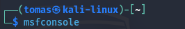  

Kokeiliin suoraan "hosts" ja "services" komentoja, mutta näkyi vain virheilmoitus:  
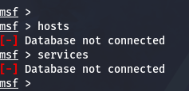  

Aloitin prosessin, jossa otin postgreSQL:n käyttöön, jotta saan tuotua alussa luodun metasploitable.xml tiedoston metasploittiin:  
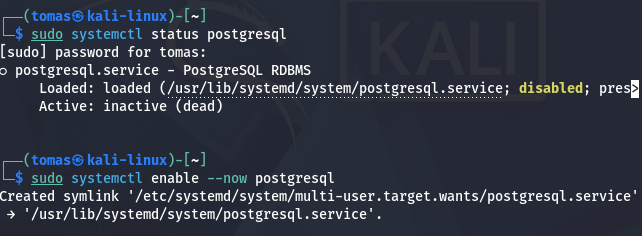  
*sudo systemctl enable --now postgresql*  

Tässä vaiheessa postgreSQL käynnistyi, mutta jokin puuttui.   
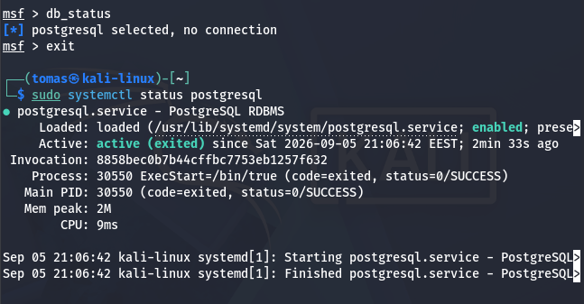  

Puuttui vielä yksi komento, joka valmistelee postgreSQL:n metasploitin käyttöä varten. Sen jälkeen sain vihdoin tuotua .xml tiedoston metasploitiin.  
*sudo msfdb init*  
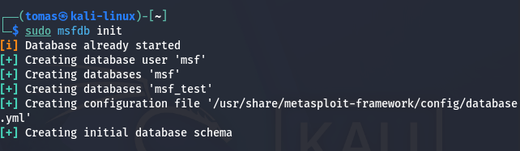  
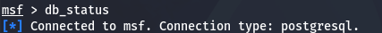  
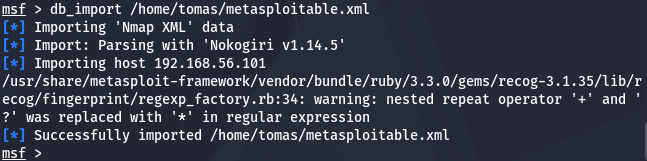  

> **Note** ChatGPT V5.6 käytettiin tehtävän komentojen luomisessa.  

## c) Tarkastele Metasploitin tietokantoihin tallennettuja tietoja komennoilla "hosts" ja "services"  

Nyt kun kaikki alkoi toimimaan, käytin komentoja "hosts" ja "services" tietojen tarkastelua varten.  
Services osiossa oli paljon enemmän dataa host osaan verrattuna.  
  

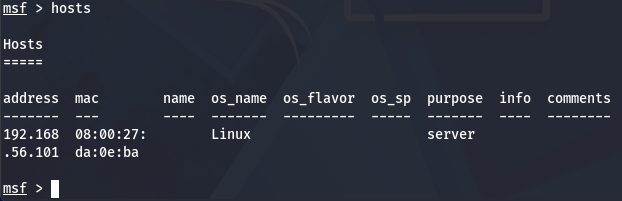  

Käytin komentoa *services -S http* suodattamalla palveluita, joissa esiintyy nimike "http"  
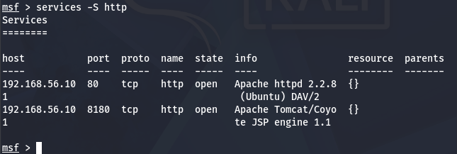

## d)  Internet famous. Etsi Metasploitablen mukana tulevista hyökkäyksistä (en: exploits; search) sellainen, joka on ollut julkisuudessa  
Yksi metasploitablessa portilla 21 pyörivä palvelu oli ftp, vsftpd 2.3.4.  
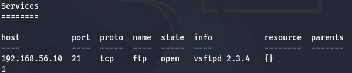  
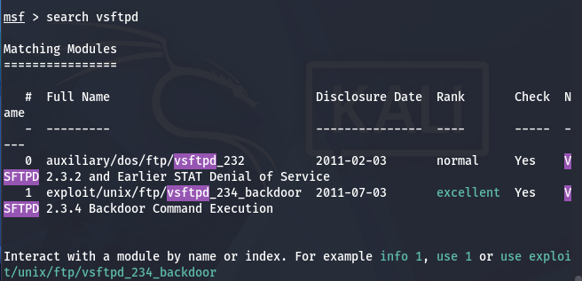  
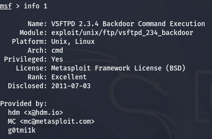  
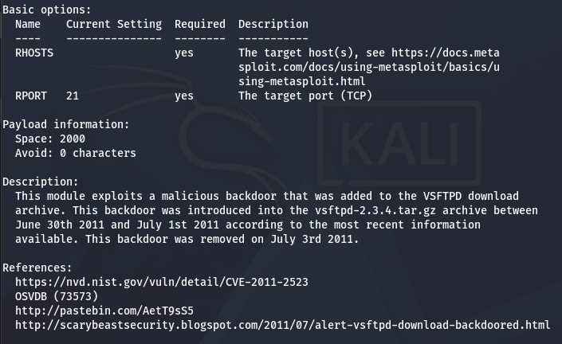  

## e) Vertaile nmap:n omaa tiedostoon tallennusta (-oA foo) ja db_nmap:n tallennusta tietokantoihin  

## f) Murtaudu Metasploitablen vsftpd-palveluun  

## g) Kerää levittäytymisessä (lateral movement) tarvittavaa tietoa metasploitablesta. Analysoi tiedot  

## h) Murtaudu Metasploitableen jollain toisella tavalla  

## i) Demonstroi Meterpretrin ominaisuuksia  

## j) Tallenna shell-sessio tekstitiedostoon script-työkalulla (script -fa log001.txt) tai tmux:lla  

## k) Pivot point. Laita kaikki harjoituksen tiedostot (script -fa, nmap -oA...) samaan kansioon. Hae sopiva pivot point (sovellus, versio, osoite, MAC-numero) 'grep -r' -komennolla. Keksi uskottava esimerkkikysymys, johon haet vastausta  

## l) Attaaack! Mitä Mitre Attack taktiikoita ja tekniikoita käytit tässä harjoituksessa? (Tässä alakohdassa "Attaack!" ei tarvitse tehdä lisää testejä koneella, koska testit on jo tehty.)  

Lähteet: Nmap.org: https://nmap.org/book/output-formats-commandline-flags.html  
