# h4 Täysin Laillinen Sertifikaatti  

## x) Lue/katso ja tiivistä  
### OWASP 2021: OWASP Top 10:2021  
### PortSwigget Academy:  
- Insecure direct object references (IDOR)  
(IDOR) on eräs pääsynvalvonnan haavoittuvuustyyppi, joka syntyy, kun sovellus käyttää käyttäjän antamaa syötettä kohteiden suoraan käsittelemiseen. Esimerkkinä tästä on tietokantaan kohdistuva IDOR, jossa URL-parametrejen tietoja voidaan muokata ja näin nähdä toisen käyttäjän tietoja.  
/customer_account?customer_number=**132355** = Oma käyttäjä  
/customer_account?customer_number=**132356** = Jonkun toisen käyttäjä  
(Portswigger a)  

- Path traversal
Path traversal hyökkäyksessä verkkosivun tiedostopolun arvoa muutetaan yrittäessä päästä käsiksi palvelimen muihin tiedostoihin.  
Tämän avulla hyökkääjä voi lukea tiedostoja palvelimelta, missä sovellusta suoritetaan.  
(Portswigger b)  
  
- Cross-site scripting
Cross-site skriptaus on verkkosovellusten tietoturva-aukko. Siinä hyökkääjä voi häiritä tai kaapata käyttäjän ja haavoittuvan sovelluksen välistä toimintaa.
Tämä toteutuu, hyökkääjä laittaa haavoittuneen verkkosivun palauttamaan haitallista JavaScriptiä käyttäjälle ja se suoritetaan.  
(Portswigger c)  

## a) Asenna OWASP ZAP, generoi CA-sertifikaatti ja asenna se selaimeesi. Laita ZAP proxyksi selaimeesi. Laita ZAP sieppaamaan myös kuvat, niitä tarvitaan tämän kerran kotitehtävissä. Osoita, että hakupyynnöt ilmestyvät ZAP:n käyttöliittymään  

Asensin Zaproxin ja generoin sertifikaatin FireFoxia varten.  
Zaproxin oletusnäkymä:  

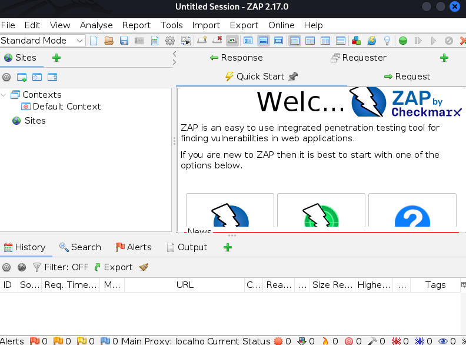  

Menin Zaproxin oletusnäkymästä: Tools --> Options --> Network --> Server Certificates  

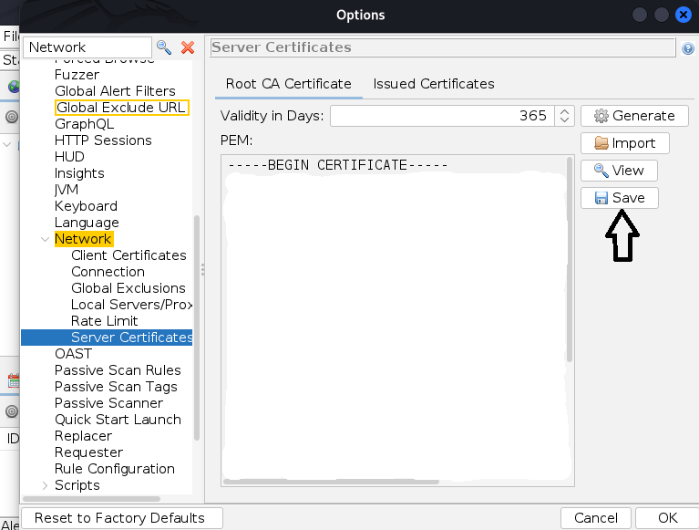  

Tallensin luodun sertifikaatin ja Laitoin Firefoxin käyttäämään sitä.  

  
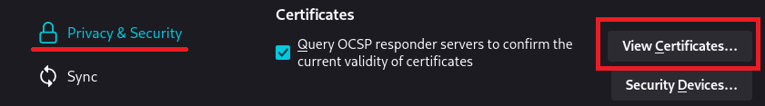  

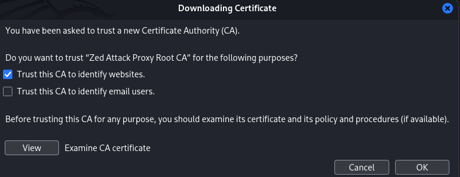  

Asetin proxyn FireFoxin yleisistä asetuksista kohdasta network:

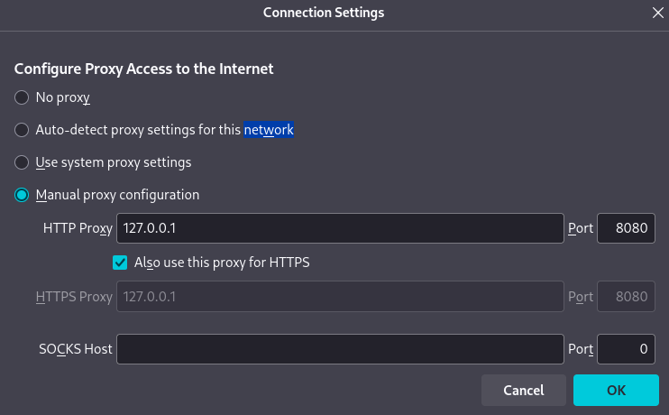  

Testasin toimivuutta menemällä temu.com:  
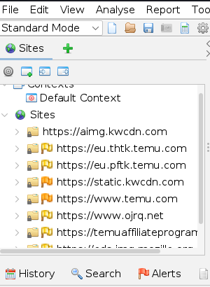  

Menin hieman säätämään vielä, saadakseni ZAP history-välilehdeltä näkymään pyynnöt kuvista:  
oletusnäkymästä Tools --> Display  
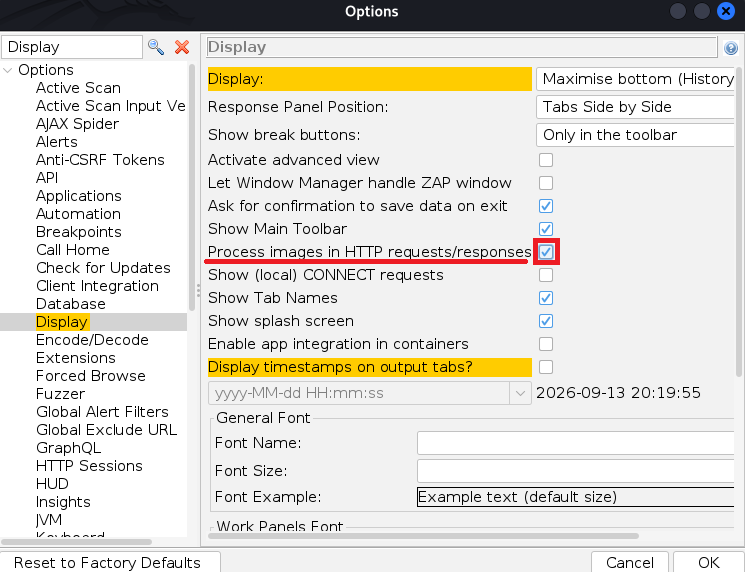  

Ja tämä näyttäisi toimivan.  
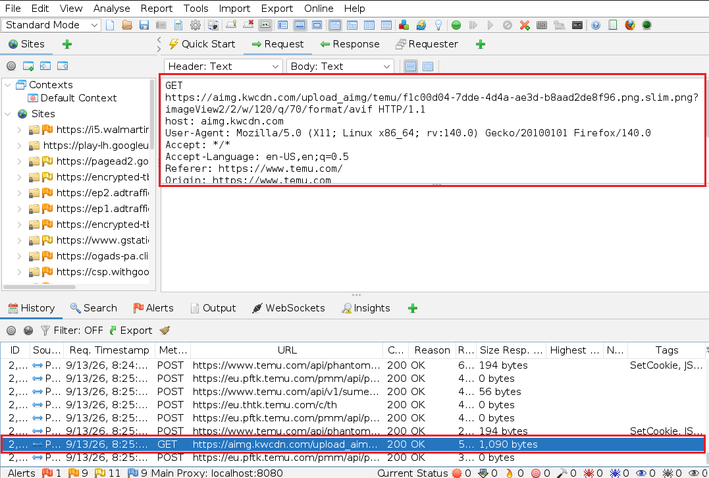  

## b) Asenna "FoxyProxy Standard" Firefox Addon, ja lisää ZAP proxyksi siihen. Käytä FoxyProxyn "Patterns" -toimintoa, niin että vain valitsemasi weppisivut ohjataan Proxyyn  

Asennetaan FoxyProxy Standard:  

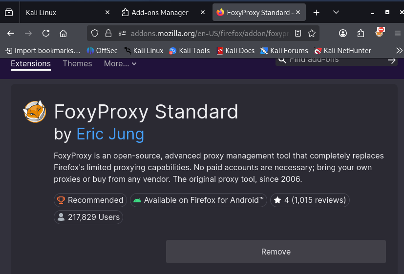  

Seuraavaksi Firefoxin yleisistä asetuksista kohtaan network:  

Asetetaan no proxy, jotta voidaan hallita tätä FoxyProxyn kautta:  
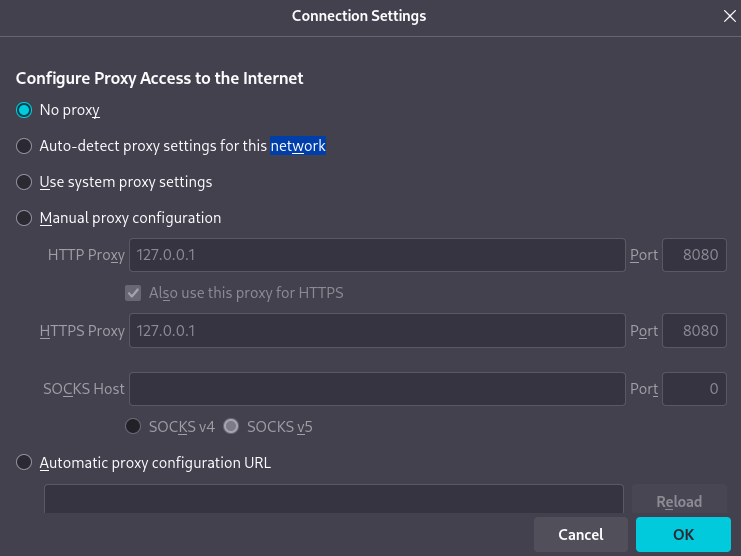  

Menin seuraavaksi avaamaan FoxyProxin. Siirryin asetuksiin --> Proxies ja lisäsin FoxyProxin tavan yhdistää ZAP:iin.  
Käytän "Proxy by patterns" tarvittaessa. Sen avulla vain annetun sivun liikenne menee ZAP:iin.  
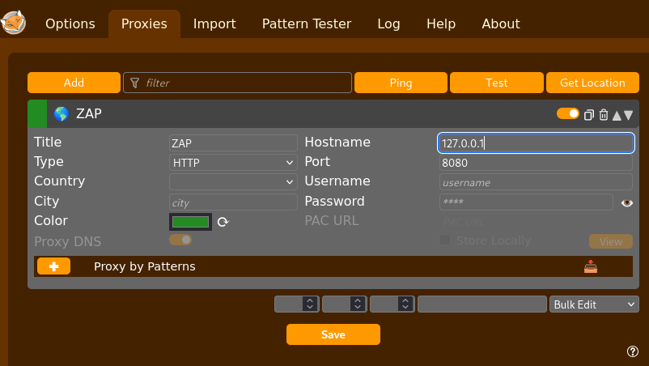  

 

 

## PortSwigger Labs. Ratkaise tehtävät.  

## Cross Site Scripting (XSS)  
### c) Reflected XSS into HTML context with nothing encoded  

Labran ohjeissa kerrotaan, että sivun hakukentässä on haavoittuvuus ja sen avulla on tulostettava "alert"  

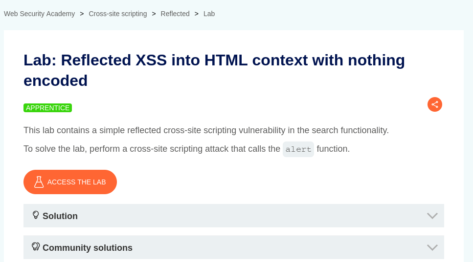  

 

Katsoin melko nopeasti aluksi vastauksen, sillä en saanut hahmotettua, mistä edes aloittaa.  

Ymmärsin ainakin sen, että hakukenttään voidaan sijoittaa koodia pelkän tavallisen tekstin sijasta.  
Hakukentän haavoittuvuuden ansiosta nettisivu ei tulkitse koodinpätkää pelkkänä tekstinä.  

Tässä on vasta GET pyyntö palvelimelle, kun suoritetaan: ""  

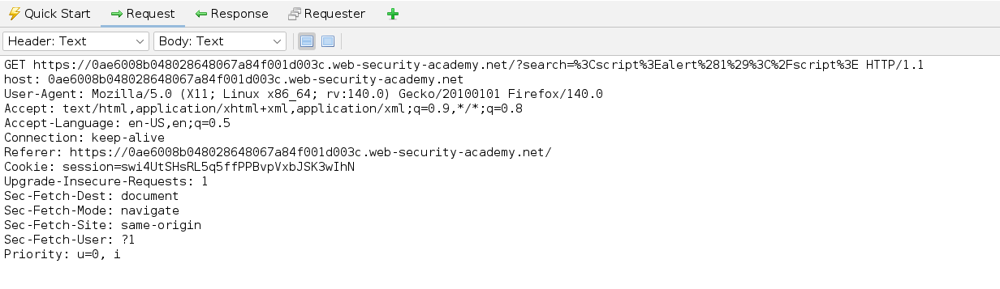  

Mutta mitä palautuu takaisin?  
Tässä nähdään, kuinka skripti osuus ei lueta pelkkänä tekstinä, vaan suoritettavana koodina:  
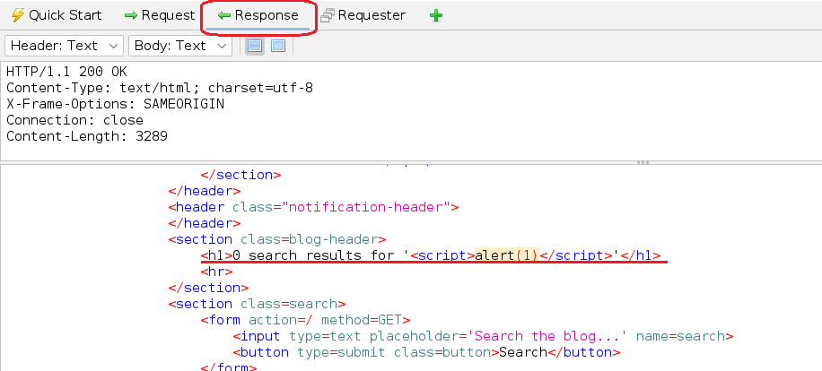  

Tein testejä, miltä teksti näyttää HTML:ssä  
erikoismerkit "<>" tulostetaan sellaisenaan ja on juuri se syy, miksi hakukentässä on haavoittuvuus.  

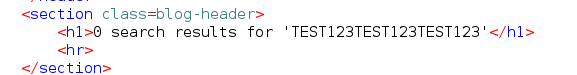  
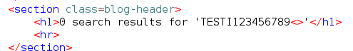  

### d) Stored XSS into HTML context with nothing encoded  

Tehtävässä on haavoittuvuus kommenttikentässä. Tarkoitus on luoda kommentti, joka käynnistää "alert" funktion katsoessa blogia.  
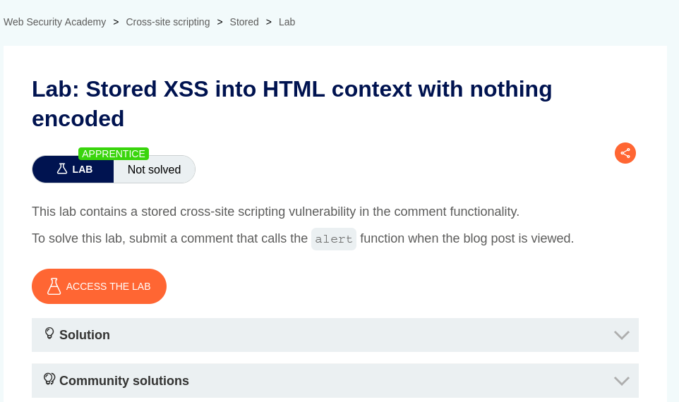  

Nyt tiedän, millä tavalla kutsutaan funktio edellisestä tehtävästä.  
Suuntasin sivun blogeille, jossa eri kenttiä löytyy.  

Tässä on yhden blogin kommenttikenttä.  
Siihen lisätään vain alert skripti ja loput tiedoista täytetään.  
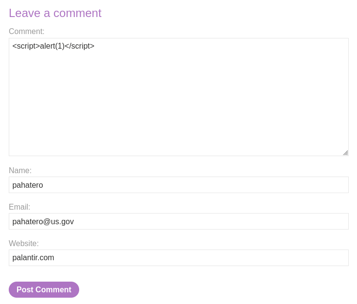  

Nettisivu kenttä esti kommentin antamisen, mutta sen pystyi jättämään tyhjäksi.  
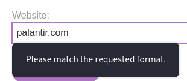  

Tämän jälkeen, kun mennään samaan blogiin takaisin, käynnistyy alert(1).  
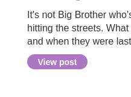  

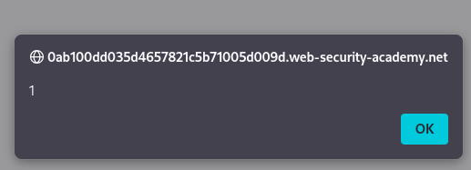  

Seuraavaksi oli tarkoitus etsiä ZAP:sta, missä näkyy lähetetyt ja palvelimelta vastaanotetut tiedot.  
Tämä koutui erittäin haasteliaaksi.  
Ainoa hyödyllinen asia, mitä sain ZAP:sta oli postID.  
Mutta sitten tämän avulla hain ZAP:sta oikean pyynnön.  
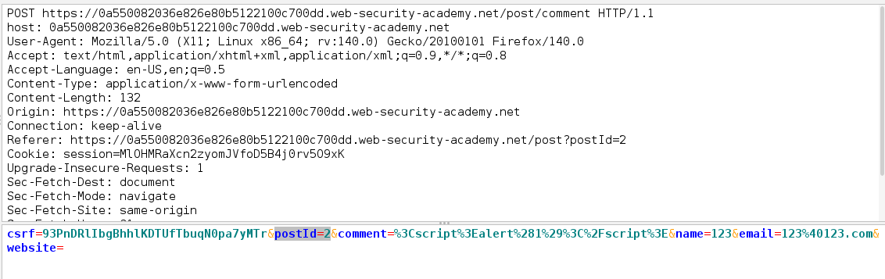  

Tämän avulla voi nähdä, mitä palvelin otti vastaan.  

### e) Selitä esimerkin avulla, mitä hyökkääjä hyötyy XSS-hyökkäyksestä. Alert("Hei Tero!") ei vielä tarjoa kummoista pääsyä. (Tässä alakohdassa ei tarvitse tehdä testejä tietokoneella, pelkkä lyhyt ja selkeä selitys riittää.)

XSS:llä voidaan luoda sessiokaappaus. Sessiokaappauksessa hyökkääjä pääsee käsiksi käyttäjän tietoihin tietokonejärjestelmässä hänen evästeitä kaappaamalla.  
(Wikipedia)  

 

## Path traversal  
### f) File path traversal, simple case. Laita tarvittaessa Zapissa kuvien sieppaus päälle.  

Tehtävässä kuvissa on haavoittuvuus niiden näyttämisessä.  
Tarkoitus on päästä tiedoston /etc/passwd kansion tietoihin.  
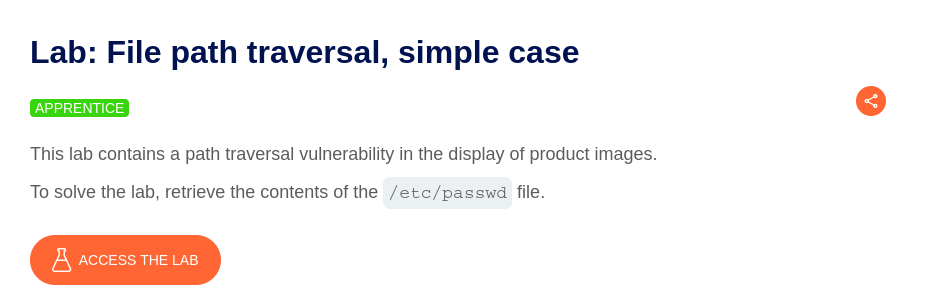  

Aluksi yritin suorittaa selaimen kautta, mutta tämä ei oikein toiminut.  
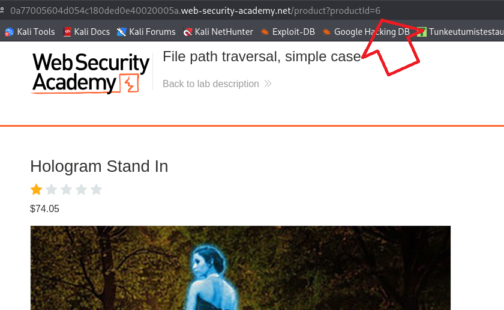  
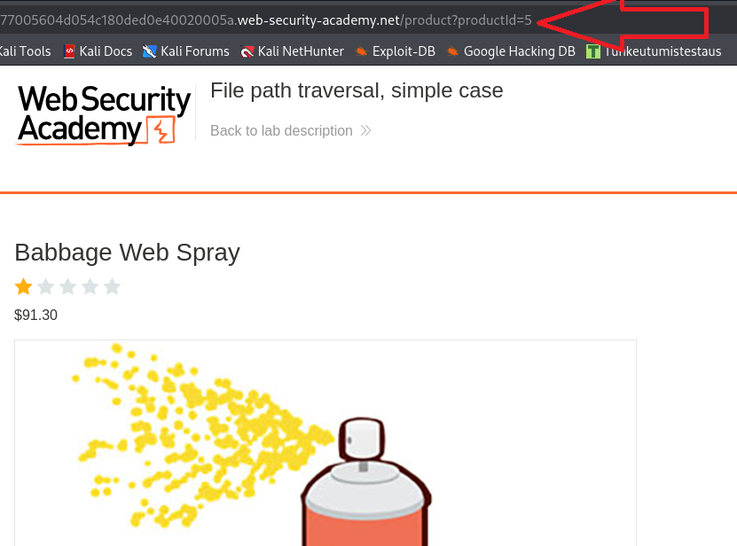  
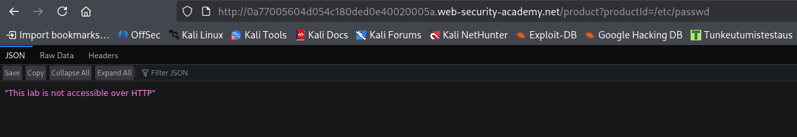  

Seuraavaksi menin ZAP:iin, jossa valitsin verkkosivun GET pyynnön.  
Otin käyttöön Manual Request Editorin, jonka avulla voin muokata koodia ja lähettää pyyntöjä takaisin.  
Näissä ilmoitus palvelimelta oli joko virheilmoitus tai 200, eli ok?  
Mutta en vieläkään ymmärtänyt, teinkö jotain oikein. Tiesin vain, milloin tein jotain väärin.  

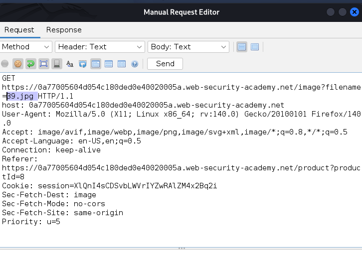  
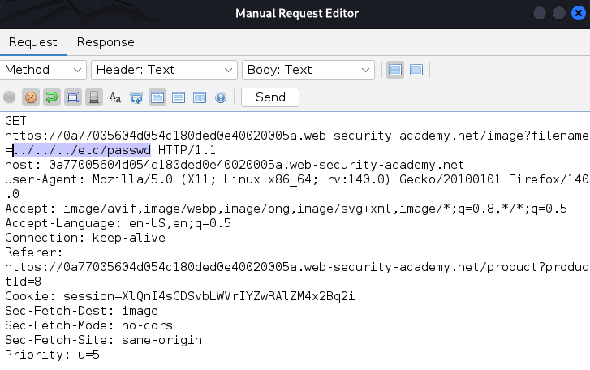  
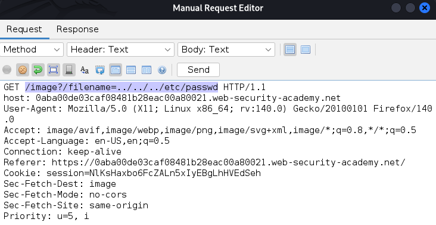  

Tein vielä viimeisen yrityksen.  
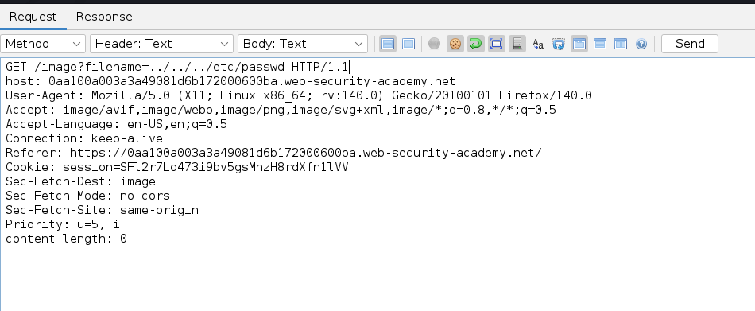  
Mutta tulostuu vain virhe.  

### g) File path traversal, traversal sequences blocked with absolute path bypass  

Tässä tehtävässä yritetään suorittaa läpikäyntihaavoittuvuus, mutta sivu hylkää hakemistosiirtymät, eli ../../  
Nettisivu silti käsittelee annettua tiedostonimeä suhteessa oletustyöhakemistoon.  
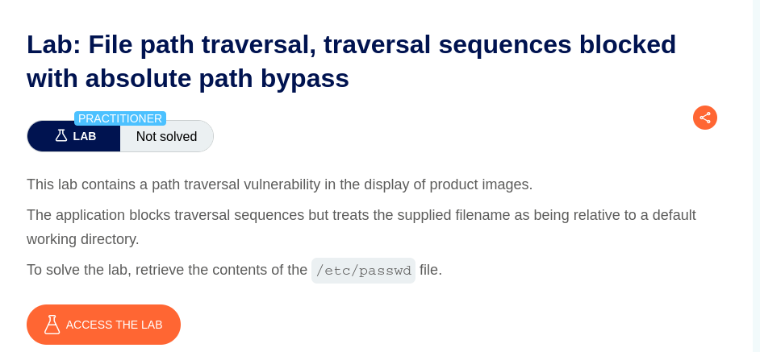  

Kun ZAP:llä kuunneltiin verkkoliikennettä, nähdään kuinka tiedostoa pyydetään suoraan sen nimellä.  
**/image?filename=**  
Hakemistösiirtymiä ei hyväkstyä, mutta absoluuttisia polkuja ei ohiteta. Juuri kuinka tehtävän nimessä vihjattiin.  
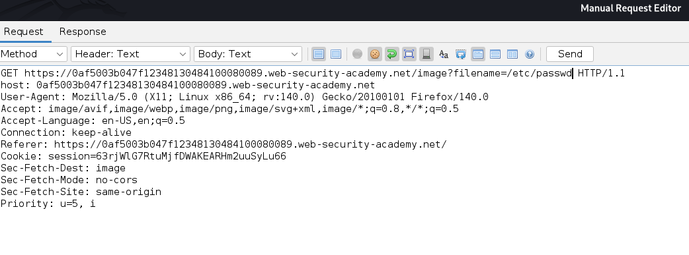  

Jos lähetetty viesti takaisin toimii, näkymällä "text" näkee itse "passwd" tiedoston tiedot.  
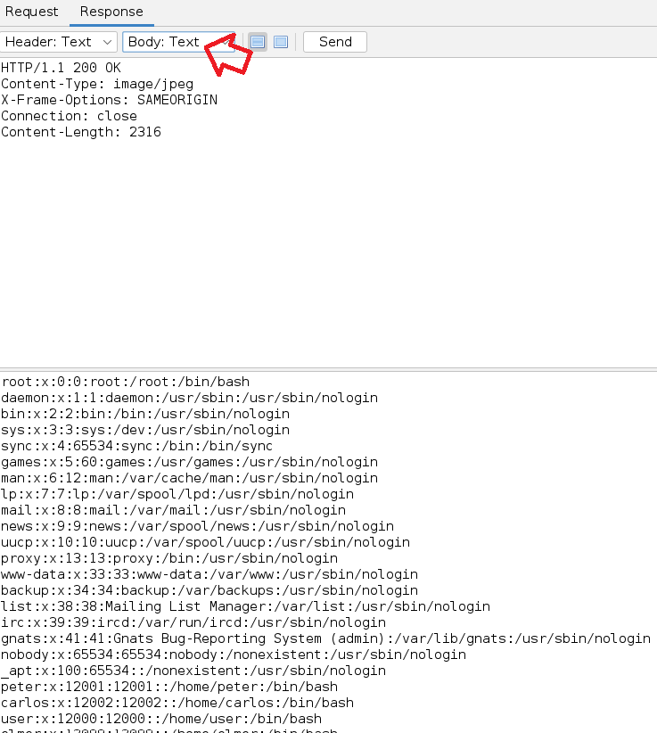  

### h) File path traversal, traversal sequences stripped non-recursively  

Tehtävässä hakemistosiirtymät poistetaan ei-rekursiivisesti, eli vain kerran.  
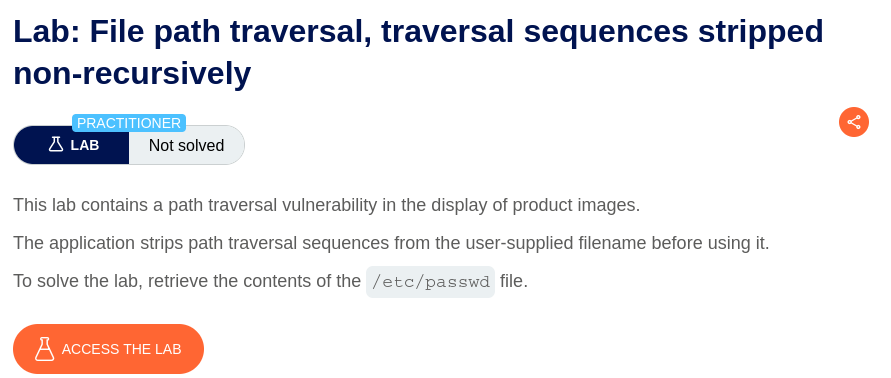  

  

## Insecure Direct Object Reference (IDOR)  
### i) Insecure direct object references  

Lähteet:  
Wikipedia. https://en.wikipedia.org/wiki/Session_hijacking   
Portswigger a: https://portswigger.net/web-security/access-control/idor  
Portswigger b: https://portswigger.net/web-security/file-path-traversal  
Portswigger c: https://portswigger.net/web-security/cross-site-scripting  
