# Elokuu2026!  

## x) Lue/katso ja tiivistä  

- Karvinen 2022: Cracking Passwords with Hashcat  
  
Tietokoneet ja laitteet eivät säilytä salasanoja sellaisinaan, vaan ne säilytetään tiivisteinä.  
Tiivistäminen on yksisuuntainen toiminto, joten tiivistettyjä salasanoja ei voi muuttaa takaisin alkuperäiseksi.  
Mutta niitä voidaan silti murtaa laittamalla kone arvaamaan.  
(Karvinen, 2022)  

Hashcatin avulla voidaan murtaa salasanoja. Jos lähdetään arvaamaan salasanaa, tarvitaan sanatiedosto, josta Hashcat lähtee arvaamaan.  
Käyttäjän on tunnistettava aluksi, minkä tyyppistä tiivistettä ollaan murtamassa.  
**hashid -m (tiiviste)** komento pyytää Hashcat numeroa.
Saatu Hashcat numero antaa tyyppi tiedon, ja sitä tarvitaan murtamisessa.  
(Karvinen, 2022)  

  
- Karvinen 2023: Crack File Password With John  
John the ripper ohjelmaa voidaan käyttää salasanalla suojattujen tiedostojen murtamiseen.
Artikkelissä käydään läpi, kuinka John the ripperiä käytetään salasanalla suojattujen .zip tiedostojen murtamisessa.
Yksinkertainen tapa aloittaa .zip tiedoston murtaminen on komennoilla:
- $ $HOME/john/run/zip2john tero.zip > tero.zip.hash  
  tero.zip tietoja siirretään tero.zip.hash tiedostoon.  
- $ $HOME/john/run/john tero.zip.hash  
  Ohjelma käynnistettään kohteena tero.zip.hash  
(Karvinen, 2023)  

  

## a) Asenna Hashcat ja testaa sen toiminta murtamalla esimerkkisalasana  
Teen tehtävässä oman salasanan, tiivistän sen ja annan Hashcatin arvata sen RockYou sanalistan avulla.  
> **Note** Työn tukena käytetty teköälyä Gemini 3.5 Flash  

 

Asensin Hascatin ja Hashid:  
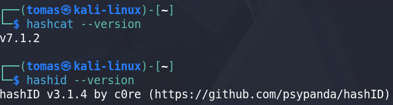  

Hankin RockYou sanalistan.  
Sanalistan avulla voidaan arvata salasana:  
  

Tässä salasanan tiivistys:  
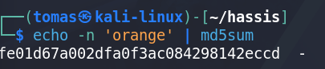  

Tässä tiivisteen mahdollinen tyyppi voidaan selvittää.  
Mutta tehneeni itse salasanan tiivistyksen MD5:lla, tämä vaihe ei ole kovin hyödyllinen.  
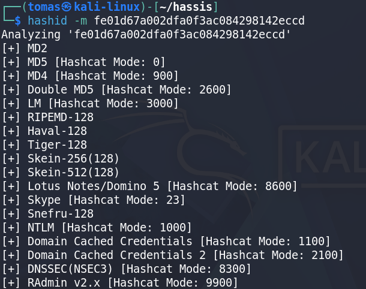  

Valitsin tyypiksi MD5 ja aloin murtamaan, mutta ensin tuli virhe.  
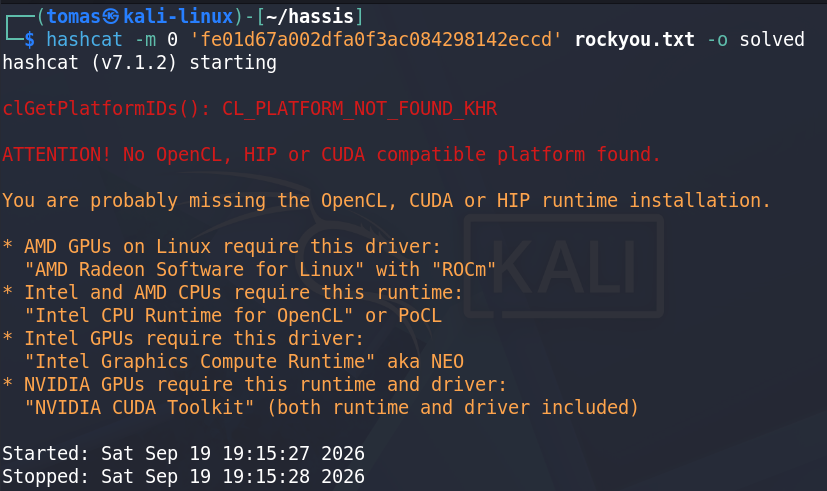  

Nopea korjaus oli vain asentaa tarvittavat paketit:  
  

Yritin uudestaan ja pitkän listan tekstiä jälkeen kaikki vaikutti toimivan.  
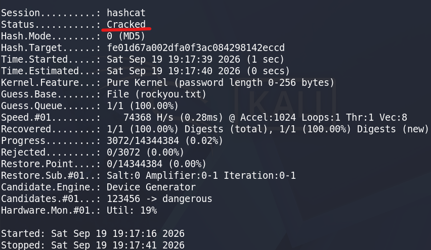  

Tulos on, mitä haluttiin.  
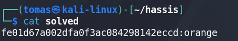  
> **Note** Työn tukena käytetty teköälyä Gemini 3.5 Flash  

 

## c) Asenna John the Ripper ja testaa sen toiminta murtamalla jonkin esimerkkitiedoston salasana.  

John the ripper näyttää olevan kalissa oletuksena asennettu.  
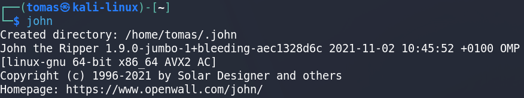  

Mitä tapahtuu seuraavaksi?:  
- Aluksi luodaan sana "salaista" ja tämä tallennetaan salapaikka.txt sisälle, joka samalla luodaan.  
- Seuraavaksi salazip.zip tiedosto luodaan, jonne salapaikka.txt sijoitetaan.
  salazip.zip samalla suojataan salasanalla "salaista".  
- salazip.zip tiedostosta otetaan suojaustiedot talteen tiiviste.txt tiedostoon John the ripperiä varten. Muuten John ei voi käsitellä tiedostoa.
- John the ripper käynnistetään ja laitetaan etsimään oikeaa salasanaa tiiviste.txt sisällä olevaa tiivistettä varten.  

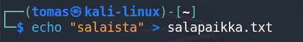  

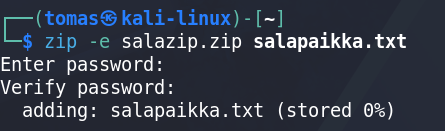  

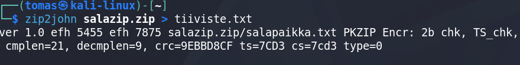  

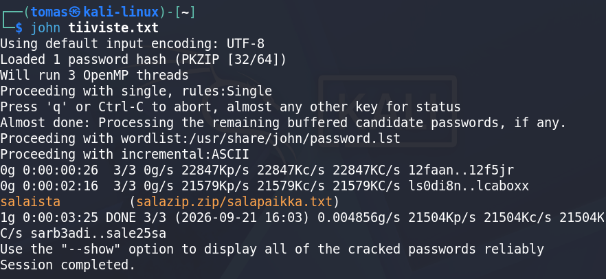  

## e) Tiedosto. Tee itse tai etsi verkosta jokin salakirjoitettu tiedosto, jonka saat auki. Murra sen salaus. (Jokin muu formaatti kuin aiemmissa alakohdissa kokeilemasi).  

Käytin tässä John the ripperiä murtaakseni .rar tiedoston salasanan.  

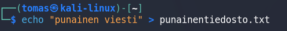  

Tässä luodaan uusi arkisto kiva_paikka.rar salasanasuojattuna, jonka sisälle lisätään punainentiedosto.txt.  
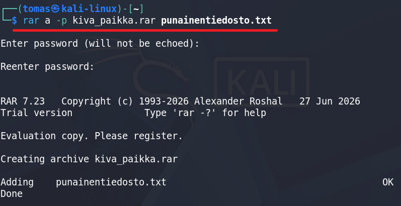  

Tässä kiva_paikka.rar salasanan tiiviste luetaan ja tallennetaan tiedostoon rar_tiiviste.txt  
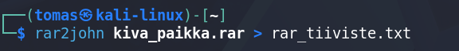  

Jokin ei ole oikein, salasana liian pitkä tai jokin asetus pielessä.  
Keskeytin murtamisen.  
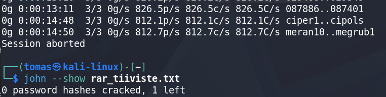  

Menin purkamaan RockYou tiedoston, ehkä sen käyttäminen nopeuttaisi murtamista:  
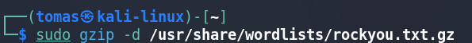  
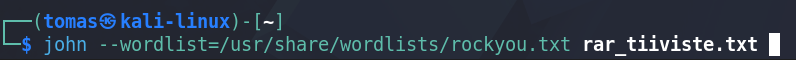  

Tosiaan mikään ei oikeastaan muuttunut.  
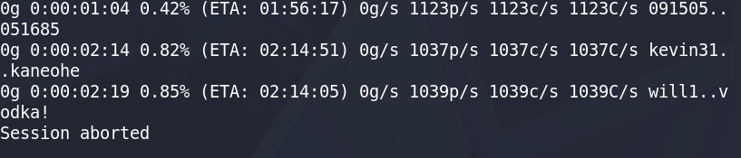  

Tein tiedostot uudestaan ja yritin murtaa ilman sanalistaa.  
Salasana "T10" pitäisi olla tarpeeksi helppo:  
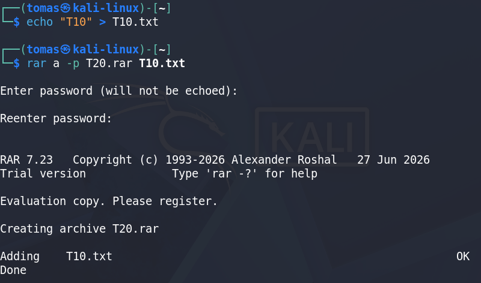  
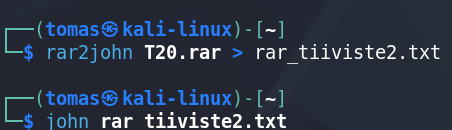  

Eipä ollut ja lopetin murtamisen.  
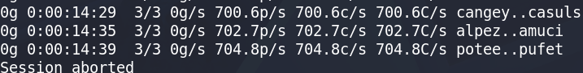  

Käytin lopuksi: **john --mask'?u?d?d' rar_tiiviste2.txt**  
Jonka avulla asetetaan tarkka tapa, miten salasanaa arvataan.  
- ?u = uppercase  
- ?d = digit  

Joten salasanan arvaus oli välitön.  
Tämän avulla sain nähdyksi, että ohjelmisto edes toimi.  
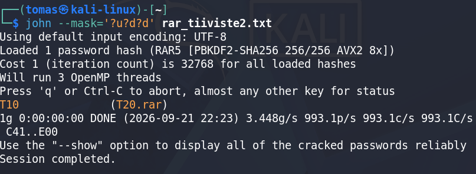  

## f) Tiiviste. Tee itse tai etsi verkosta salasanan tiiviste, jonka saat auki. Murra sen salaus. (Jokin muu formaatti kuin aiemmissa alakohdissa kokeilemasi.  

Loin SHA-512 salasanatiivisteen salasanalle "salasana123"  
Käyttäjä luodaan suoraan kotihakemistoon ja salasana asetetaan.  
Katsoin, että tiiviste on asetettu käyttäjälle. Tallensin sen.  

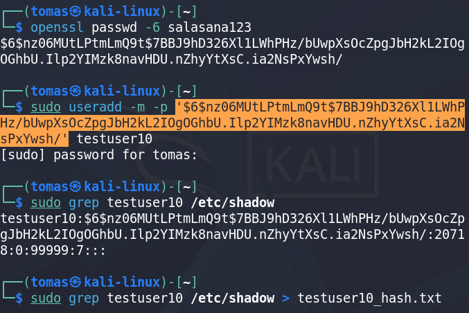  

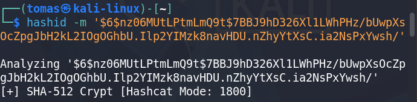  

Ajoin Hashcatin:  
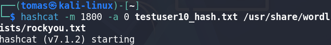  
Tavallaan tämä toimii mutta aikaa ei ole.  
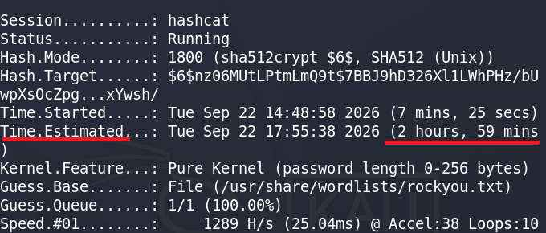  

Loin salasana tiedoston, jossa on oikea salasana.  
Käytin sitä Hashcat:ssä, jotta saan nopeasti murrettua salasanan ja näen, että ohjelma toimii.  
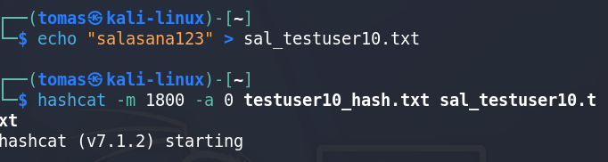  

Tässä aluksi automaattisesti tunnistettu tiiviste ja kuvan lopussa asetettuna oikea tiivisteen tyyppi.  
Molemmat silti oikeat.  
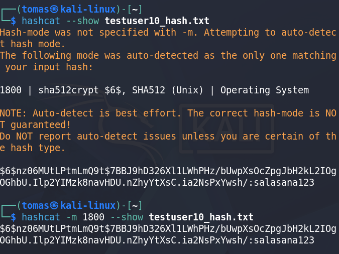  

## g) Sanakirja. Oman sanakirjan teko parantaa onnistumismahdollisuuksia. Demonstroi, kuinka teet oman sanakirjan hashcat:n tai john:iin.  

Tein sanalistan, jota käytin Hashcatin kanssa aiempaa testuser10 varten.  

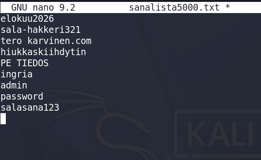  

Tässä **--potfile-disable** pitää huolen, että tämä kohde käydään läpi vain antamani sanalistan avulla.  
Muuten Hashcat katsoisi vain potfileä, jossa tunnetut oikeat salasanat pidetään.  
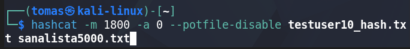  
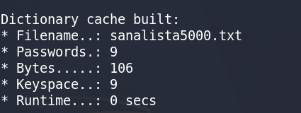  

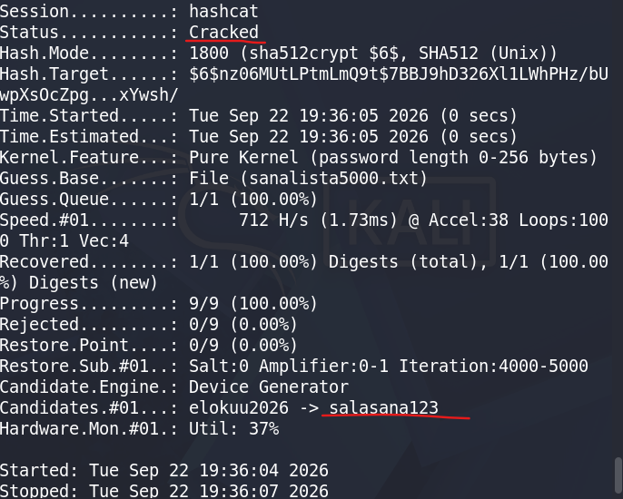  

## h) Hash rules. Näytä esimerkki HashCatin sääntöjen käytöstä (rules).  

Tein käänne säännön. Luodaan vain .rules tiedosto, joka esitetään komennon lopussa, ennen kuin kohdetta käydään läpi.  
komennolla "r" saadaan sanalistan salasanat käännettyä ympäri.  
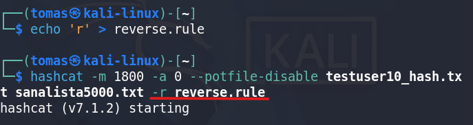  

Salasana luetaan käännöksen jälkeen, joten vaikka oikea esiintyy sanalistassa, käännettynä se ei käy.  
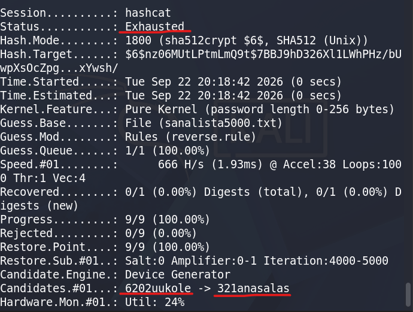  

  Lähteet:  
  https://terokarvinen.com/2022/cracking-passwords-with-hashcat/  
  https://terokarvinen.com/2023/crack-file-password-with-john/  
  
  
