# h6 Fuzzy Feeling Upon Finding  

## x) Lue/katso/kuuntele  
- Hoikkala 2026: Fuzzing with Fuff  
  12345xxxxxxxxx  

### a) Tallenna itsellesi kopio säännöistä. Kirjoita omin sanoin:  
- Scope. Mikä on kohde?
  Kohteena on: https://ffuf.io.fi  

- Rules of engagement. Mitä sille saa tehdä, eli mitä tai millaisia menetelmiä saa käyttää?  
  Kohdesivulla kerrotaan tämän olevan fuzzaus kohde.
  Tarkoitus on siis käyttää vain ffufia lippujen löytämiseen.  
  
- Mihin oikeutesi tehdä tietoturvatestausta tähän kohteeseen perustuu?  
  Se perustuu sivulla annettuihin ohjeisiin käyttää kohdetta ffufin testaamiseen.  
  Kohdesivu ei ole tavallinen nettisivu ja aitoa arkaluenteista tietoa ei sieltä voi saada.
  
- Riskit ja mitigointi. Tuo palvelin on Internetissä. Tunnista lyhyesti riskit ja niiden mitigointi ennen käytännön harjoittelua.  
  Riskinä on Denial of Service, jossa sivulle pääsy voidaan estää.
  Tämä mitigoidaan lyhyiden skannauksien avulla, jossa mahdollinen DoS aika pidetään lyhyenä.  

### b) Asenna ffuf versio, joka tukee aivan uutta preflight-ominaisuutta.  
  > **Note**: Työn tukena käytetty teköälyä Gemini 3.5 Flash.  
  > Tältä kysyin, miten ffufin uusin versio saadaan, ja ehdotuksena Gemini käytti Go:n asennushakemistoa:  
  > sudo apt install golang -y  
  > go install github.com/ffuf/ffuf/v2@latest  
  > Kysyin vielä, voiko tarkan 2.3.0 version saada melkein samalla komennolla, jota lopuksi päätin käyttää.  
  > go install github.com/ffuf/ffuf/v2@2.3.0  
  
  Asensin ffuf 2.3.0 version. Suoran version saaminen oli haasteliasta, sillä pelkkä ffuf --version näyttää versioita 2.1.0 dev.  
  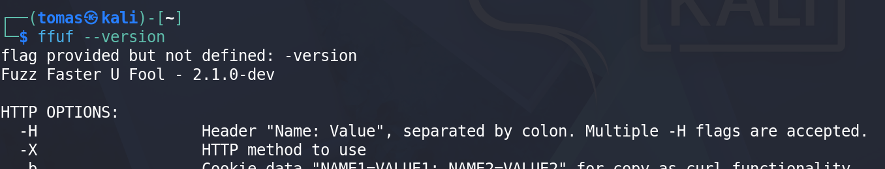  

  Kysyin Geminiltä, millä muulla tavalla voin saada selville preflight ominaisuuden olemassaolon.  
  Sillä sain komennon, joka vain katsoo, että preflight merkkijono on olemassa ffufin help sivulla.  
  > Gemini: ffuf -h | grep preflight  
  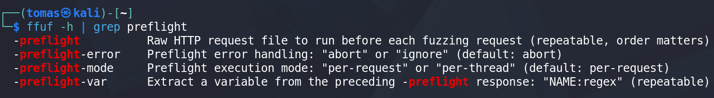  

  
  
  

### Vaultline  
Suoritin ennen aloitusta komennot:  
> curl -O https://ffuf.io.fi/wordlists/content.txt  
> curl -O https://ffuf.io.fi/wordlists/passwords.txt  
>
> ffuf -w content.txt -u https://ffuf.io.fi/FUZZ  

c1) Content discovery: Find the paths that exist but are not linked from anywhere.  

Tarkoitus on siis etsiä polkuja, joita ei nää normaalisti sivulla.  
Komento saatiin Geminiltä. En ymmärrä laisinkaan mitä komentoa on tarkoitus käyttää.  
Käytin tunteja, mutta en nyt saa mitään toimivaa komentoa aikaiseksi.  
Jokainen tulostaa suoraan jokaisen sanan, tai filtteröi ja ei tulosta mitään.  
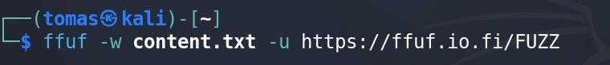  

Sain tehtyä jotain.  
Ihan vain ohjeita tarkemmin katsoessa saadaan oikea komento, johon vain lisätään -ac joka tekee autokalibroinnin:  
**ffuf -w content.txt -u https://ffuf.io.fi/FUZZ -ac**  
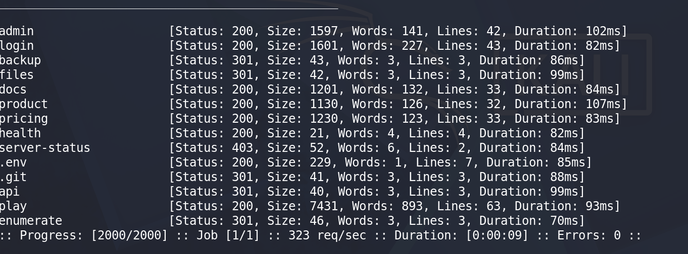  

c2) The interesting non-200: Two planted paths do not answer 200. One of them a default run will not even consider.  
Asetuksilla -fc 200 saadaa eroteltua kaikki 200 arvoa tulostavat.  
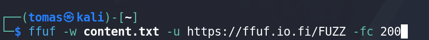  
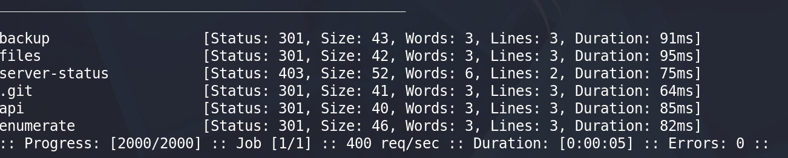  

En täysin ymmärrä, mitä halutaan etsiä, ja mikä on piilotettu polku.  

c3) Recursion: The wordlist holds names, not paths, so C1 found you 13 things and none of them nested. Descending finds more.  
Tässä siis ffuf meni sanalistan sanoilla löytämään kansion, jonka sisältä (depth 1) se skannasi samalla sanalistalla, ja löysi vuosiluvut.  
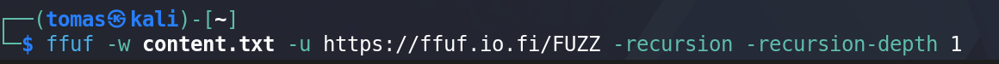  
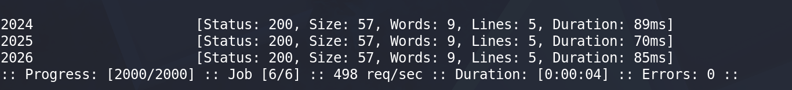  

c4) Virtual hosts: Three hostnames under ffuf.io.fi serve different content from this same address. Find all three.  

-fw 135 avulla filtteröitiin muut kohteet eri sanamäärillä ja mentiin kiinnostaviin, jotka vastaa takaisin.  
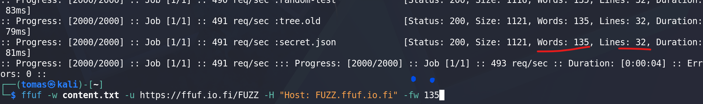  
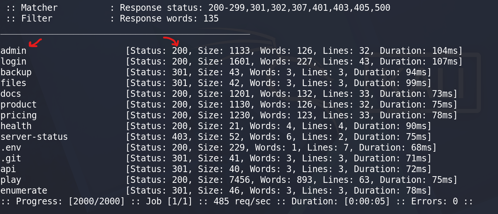  
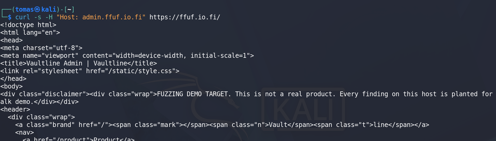  

c9) The login you cannot replay (Has preflight! Has CSRF token!): Get into the admin account. A plain password fuzz returns 403 forever, however long you run it.  

Lähteet:  
Hoikkala 2026. Fuzzing with Fuff: https://terokarvinen.com/tunkeutumistestaus/hoikkala-2026-fuzzing-with-ffuf.pdf  
Vaultline: https://ffuf.io.fi/play  
